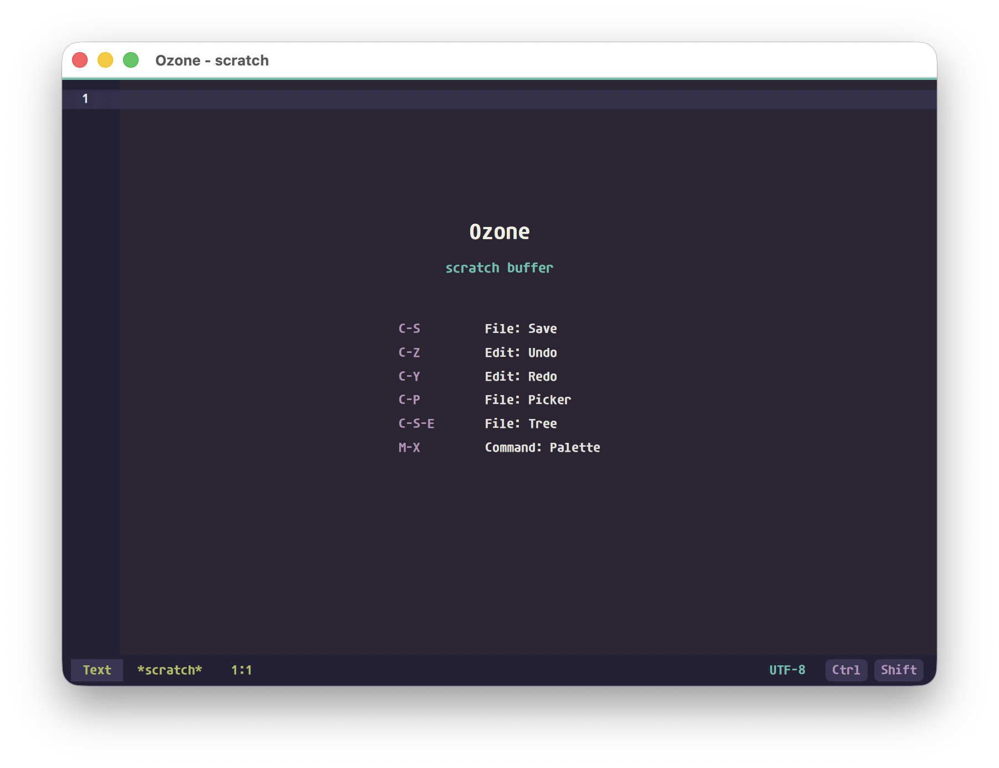

# Ozone

[](https://github.com/SkuldNorniern/ozone/actions/workflows/ci.yml)
[](https://github.com/SkuldNorniern/ozone/actions/workflows/nightly.yml)
[](https://github.com/SkuldNorniern/ozone/releases/latest)
[](LICENSE)

Ozone is a small Rust editor built around explicit editor, buffer, syntax, and
GUI crates. It is made to fit my own editor taste first, while keeping enough
configuration surface for others to reshape keymaps, themes, filetype behavior,
and UI defaults. It is a plain text editor first: no Vim-style modes, no hidden
global editor state, and no large plugin runtime while the architecture is still
settling.



## Downloads

Pre-built binaries are published automatically:

| Channel | Trigger | Platforms |
| --- | --- | --- |
| **Nightly** | Every push to `main` | Linux x64 · macOS ARM · macOS x64 · Windows x64 |
| **Release** | `v*` tag | Linux x64 · macOS ARM · macOS x64 · Windows x64 |

→ [All releases](https://github.com/SkuldNorniern/ozone/releases)

## Current Shape

Ozone is early, but the desktop GUI path is usable for scratch editing,
navigation, and small project work:

- scratch-buffer launch screen with a sample of the active keymap
- editable text buffers with undo, redo, dirty tracking, and save/save-all
- command-line file opening
- workspace file picker, open-buffer picker, and file tree
- in-buffer search/replace and literal workspace search
- line numbers, cursor-line highlight, selections, scrollbars, and mouse-wheel scrolling
- pane splits, pane focus movement, and buffer cycling
- syntax scanning for Rust, Markdown, TOML, JSON, and plain text
- PNG/JPEG image preview buffers
- configurable themes, keymaps, filetype defaults, modifier maps, and autocommands

Some pieces are intentionally still thin. Terminal buffers currently render a
placeholder surface, and LSP configuration is parsed but the LSP runtime remains
deferred. Plugin capability is planned for later, once the command, event, and
configuration surfaces are stable enough to expose cleanly.

## Build

Ozone is a Cargo workspace. All dependencies, including the
[Aurea](https://crates.io/crates/aurea) GUI toolkit, are pulled from crates.io.

```sh
cargo build --release
```

For faster development checks:

```sh
cargo check
```

### Linux

A few system libraries are required for the Vulkan/X11 backend:

```sh
sudo apt-get install -y libvulkan-dev libxcb-xfixes0-dev libxcb-shape0-dev \
  libxkbcommon-dev pkg-config libegl-mesa0
```

## Run

Open the welcome/scratch buffer:

```sh
cargo run --release
```

Open a file:

```sh
cargo run --release -- README.md
```

The debug binary works, but manual UI testing is usually more representative
with the release binary.

## Editing

Ozone is always in edit mode. Click the window if focus is elsewhere, then type
normally. The status line shows the active buffer, dirty marker, cursor position,
pane count, and active modifier state.

```text
*scratch*    1:1    pane 1/1
```

An asterisk after the buffer name means the buffer has unsaved changes. The
window title also carries the dirty marker for file buffers.

## Default Keys

| Key | Action |
| --- | --- |
| Text input | Insert text at cursor |
| `Enter` | Insert newline with indentation |
| `Tab` | Insert one configured indent unit |
| `Backspace` / `Delete` | Delete backward / forward |
| Arrow keys | Move cursor |
| `Home` / `End` | Move to start/end of line |
| `PageUp` / `PageDown` | Move and scroll one page |
| `Ctrl+Left` / `Ctrl+Right` | Move by word |
| `Ctrl+Home` / `Ctrl+End` | Move to start/end of file |
| `Ctrl+A` / `Ctrl+E` | Move to start/end of line |
| `Ctrl+B` / `Ctrl+F` / `Ctrl+P` / `Ctrl+N` | Emacs-style left/right/up/down |
| `Ctrl+S` / `Cmd+S` | Save current buffer |
| `Ctrl+K Ctrl+S` | Save all buffers |
| `Ctrl+Z` / `Cmd+Z` | Undo |
| `Ctrl+Y` / `Cmd+Shift+Z` | Redo |
| `Ctrl+P` / `Cmd+P` | Open workspace file picker |
| `Ctrl+X B` | Open buffer picker |
| `Meta+X` or `Ctrl+Shift+P` / `Cmd+Shift+P` | Open command palette |
| `Ctrl+Shift+E` / `Cmd+Shift+E` | Open file tree |
| `Meta+F` | Search current buffer |
| `Meta+H` | Search and replace current buffer |
| `Ctrl+Shift+F` / `Cmd+Shift+F` | Search workspace |
| `Meta+G` | Go to line |
| `Ctrl+Tab` / `Ctrl+Shift+Tab` | Next / previous buffer |
| `Ctrl+Shift+Right` / `Ctrl+Shift+Down` | Split pane right / down |
| `Ctrl+Shift+W` | Close active pane |
| `Ctrl+Meta+Arrow` | Focus pane in that direction |
| `Ctrl+-` / `Ctrl+=` | Jump back / forward |
| Mouse wheel | Scroll |

On macOS, `Cmd` maps to Ozone's `super` modifier. The `control`, `meta`, and
`super` mappings can be changed in config.

## Configuration

Ozone loads user configuration from:

- Windows: `%APPDATA%\ozone\config.toml`
- Linux/macOS: `$XDG_CONFIG_HOME/ozone/config.toml`, or `~/.config/ozone/config.toml`

If no config file exists, a default template is written automatically on first
launch. Every field is optional; missing or malformed values fall back silently
to defaults.

```toml
[editor]
font = "Consolas"
font_size = 13
line_height = 1.4
tab_width = 4
soft_tabs = true
line_numbers = "relative"
cursor_style = "bar"
scroll_off = 8
word_wrap = false
trim_trailing_whitespace = true
auto_save = false
auto_format = false
jump_list_size = 100

[theme]
name = "brewery-stout"

[ui]
mouse = false

[[keymap]]
keys = "ctrl+shift+p"
command = "command.palette"

[[filetype]]
name = "markdown"
word_wrap = true
tab_width = 2

[[autocmd]]
event = "buffer.pre-save"
pattern = "*"
command = "edit.trim-trailing-whitespace"
```

Bundled themes: `brewery-stout`, `brewery-wine`, `catppuccin-mocha`. A theme can
also be a path to a custom `.toml` file.

## Workspace Layout

| Crate | Role |
| --- | --- |
| `src/` | Executable entry point |
| `ozone-buffer/` | Text storage, positions, edits, undo/redo, dirty state, persistence |
| `ozone-editor/` | Workspace, views, commands, keymaps, events, UI intents |
| `ozone-gui/` | Aurea-based drawing, overlays, input routing, window integration |
| `ozone-syntax/` | Lightweight line-scanner syntax highlighting |
| `ozone-config/` | Configuration loading and validation |
| `ozone-term/` | Terminal grid and PTY support (in progress) |
| `themes/` | Bundled color themes |
| `packaging/` | Platform packaging metadata and icons |

## Notes

Ozone avoids a large dependency stack while the editor model is still in motion.
The config parser uses `toml`, but editor behavior stays in explicit Rust domain
types instead of generated Serde models.
